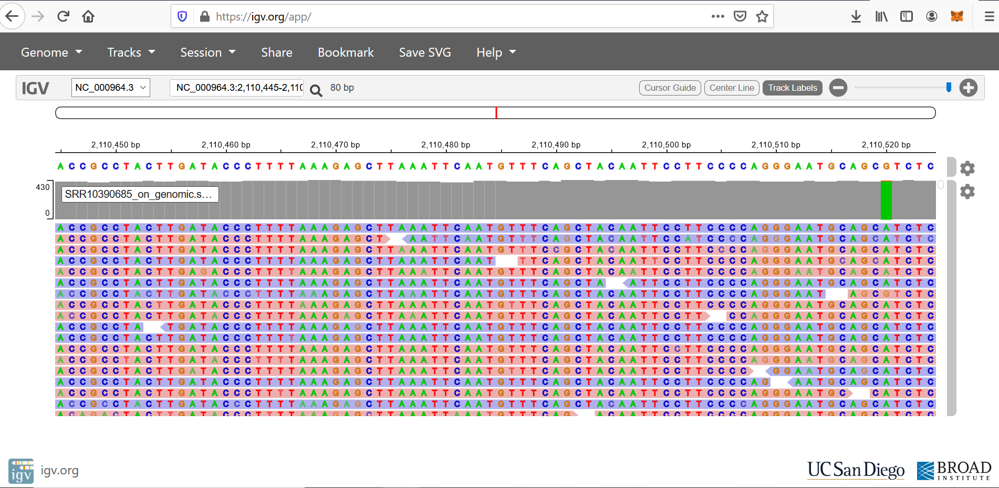

```{r setup, include=FALSE}
knitr::opts_chunk$set(eval=FALSE, echo =TRUE, cache = FALSE, message = FALSE, warning = FALSE, cache.lazy = FALSE,
                      fig.height = 3.5, fig.width = 10.5)
```

# Consignes {-}

Complétez ce document en remplissant les chunks vides pour écrire le code qui vous a permis de répondre à la question. Les réponses attendant un résultat chiffré ou une explication devront être insérés entre le balises html `code`. Par exemple pour répondre à la question suivante :

    La bioinfo c'est : <code>MERVEILLEUX</code>.
    
N'hésitez pas à commenter votre code, enrichier le rapport en y insérant des résultats ou des graphiques/images pour expliquer votre démarche. N'oubliez pas les **bonnes pratiques** pour une recherche **reproductible** !
Nous souhaitons à minima que l'analyse soit reproductible sur le cluster de l'IFB.

# Introduction {-}

Vous allez travailler sur des données de reséquençage d'un génome bactérien : _Bacillus subtilis_. Les données sont issues de cet article :

* [Complete Genome Sequences of 13 Bacillus subtilis Soil Isolates for Studying Secondary Metabolite Diversity](https://mra.asm.org/content/9/2/e01406-19)

# Analyses

## Organisation de votre espace de travail

Dans le dossier EvaluationM4M5, je vais créer différents sous dossiers:

* FASTQ

* QC

* CLEANING

* MAPPING

* RESULTS

```{bash}
mkdir Evaluation M4M5
cd Evaluation M4M5/
mkdir -p FASTQ
mkdir -p QC
mkdir -p CLEANING
mkdir -p MAPPING
mkdir -p RESULTS
tree
```

## Téléchargement des données brutes

Récupérez les fichiers FASTQ issus du run **SRR10390685** grâce à l'outil <strong class="tool">sra-tools</strong>

Pour cela, je charge le sous module `fasterq-dump` de `sra_tools`

```{bash}
module load  sra-tools
#Je télecharge les fichiers fastq bruts dans le dossier FASTQ
srun --cpus-per-task=6 fasterq-dump --split-files -p SRR10390685 --outdir FASTQ
```

Version fasterq-dump 2.10.3

Je compresse les fichiers avec `gzip`

```{bash}
#Je me déplace dans le dossier FASTQ
cd FASTQ
#Je zip tous les fichiers qui se terminent par .fastq / Assez long comme étape !
srun gzip *.fastq
#Je regarde le début du fichier
zcat SRR10390685_1.fastq.gz | head -n 8
```

Combien de reads sont présents dans les fichiers R1 et R2 ?

```{bash}
zcat SRR10390685_1.fastq.gz| echo $((`wc -l`/4))
```

Les fichiers FASTQ contiennent <code>7 066 055</code> reads.

Téléchargez le génome de référence de la souche ASM904v1 de _Bacillus subtilis_ disponible à [cette adresse](https://ftp.ncbi.nlm.nih.gov/genomes/all/GCF/000/009/045/GCF_000009045.1_ASM904v1/GCF_000009045.1_ASM904v1_genomic.fna.gz)

J'utilise `wget` pour importer le génome de référence

```{bash}
#Je me deplace dans le dossier RESULTS
cd ../RESULTS/
#J'importe le génome de ref
wget https://ftp.ncbi.nlm.nih.gov/genomes/all/GCF/000/009/045/GCF_000009045.1_ASM904v1/GCF_000009045.1_ASM904v1_genomic.fna.gz
#Je décompresse le fichier avec gzip -d
gzip -d GCF_000009045.1_ASM904v1_genomic.fna.gz
#Je renomme le fichier plus simplement
mv GCF_000009045.1_ASM904v1_genomic.fna genomic.fna

```

Quelle est la taille de ce génome ?

```{bash}
#Je regarde le début de mon fichier
head genomic.fna
#Je compte le nombre de caractère sans la premiere ligne (header)
tail -n +1 genomic.fna | wc -m
```

La taille de ce génome est de <code>4 268 374</code> paires de bases.

Téléchargez l'annotation de la souche ASM904v1 de _Bacillus subtilis_ disponible à [cette adresse](https://ftp.ncbi.nlm.nih.gov/genomes/all/GCF/000/009/045/GCF_000009045.1_ASM904v1/GCF_000009045.1_ASM904v1_genomic.gff.gz)

```{bash}
wget https://ftp.ncbi.nlm.nih.gov/genomes/all/GCF/000/009/045/GCF_000009045.1_ASM904v1/GCF_000009045.1_ASM904v1_genomic.gff.gz

gzip -d GCF_000009045.1_ASM904v1_genomic.gff.gz

mv GCF_000009045.1_ASM904v1_genomic.gff annotation.gff
#Je regarde dans mon dossier, les fichiers presents
ls
```

Combien de gènes sont connus pour ce génome ?

```{bash}
#Je regarde le debut de mon fichier
head annotation.gff
#Je compte le nombre de gene ("ID=gene") de facon unique dans la 9eme colonne, le tout est trié
cut -f 9 annotation.gff | cut -d ";" -f 1 | grep "ID=gene" | sort -u | wc -l
```

<code>4536</code> gènes sont recensés dans le fichier d'annotation.

## Contrôle qualité

Lancez l'outil `fastqc` dédié à l'analyse de la qualité des basemodules issues d'un séquençage haut-débit

J'utilise aussi `multiqc`

```{bash}
#Je vais dans dossier EvaluationM4M5
cd EvaluationM4M5

#J'importe le module fastqc
module load fastqc

#Je lance fastqc avec 8 cpu par tache, fichier de destination dans QC / -t est le nombre de tache à faire en simultané
srun --cpus-per-task 8 fastqc FASTQ/SRR10390685_1.fastq.gz -o QC/ -t 8
srun --cpus-per-task 8 fastqc FASTQ/SRR10390685_2.fastq.gz -o QC/ -t 8

#Importer les rapports sur mon ordi ou via Jupyter/Download
scp mmonnoye@core.cluster.france-bioinformatique.fr:~/EvaluationM4M5/QC/*.html .

#J'importe le module multiqc
module load multiqc
multiqc --version 
#Je lance multiqc avec -o pour specifier le dossier de destination
srun multiqc -d . -o .
#J'importe le rapport mutiqc en local
scp mmonnoye@core.cluster.france-bioinformatique.fr:~/EvaluationM4M5/multiqc_report.html .
```

Version fastqc v0.11.9

Version multiqc 1.9

La qualité des bases vous paraît-elle satisfaisante ? Pourquoi ?

- [X] Oui
- [ ] Non


car <code>le Qscore est > 30</code> comme le montre <code>le graphique "Per Base Sequence Quality" des 2 rapports FastQC</code>

Lien vers le [rapport MulitQC](https://github.com/mmonnoye/EvaluationM4M5/blob/master/multiqc_report.html)

Est-ce que les reads déposés ont subi une étape de nettoyage avant d'être déposés ? Pourquoi ?

- [ ] Oui
- [X] Non

car <code>nous voyons dans les rapports la présence des premiers cycles avec du bruit de fond, 
il y a aussi toutes les tailles de fragments et un "contaminant" dans l'onglet overrepresented sequences</code>

Quelle est la profondeur de séquençage (calculée par rapport à la taille du génome de référence) ?

```{bash}
Profondeur de séquençage = (nombre de reads x taille read) / taille du génome
                            (7066055 x 150) / 4268374
```

La profondeur de séquençage est de : <code>248</code> X.

## Nettoyage des reads

Vous voulez maintenant nettoyer un peu vos lectures. Choisissez les paramètres de <strong class="tool">fastp</strong> qui vous semblent adéquats et justifiez-les.

```{bash}
#J'importe le module fastp
module load fastp
fastp --version

#Commandes de filtrage
srun --cpus-per-task 8 fastp --in1 FASTQ/SRR10390685_1.fastq.gz --in2 FASTQ/SRR10390685_2.fastq.gz --out1 CLEANING/SRR10390685_1.cleaned_filtered.fastq.gz --out2 CLEANING/SRR10390685_2.cleaned_filtered.fastq.gz --html CLEANING/fastp.html --thread 8 --cut_mean_quality 30 --cut_window_size 8 --length_required 100 --cut_tail --json CLEANING/fastp.json

#Je charge module seqkit
module load seqkit
#Nombre de reads restants
seqkit stats CLEANING/*.fastq.gz
```
Version fastp 0.20.0

Les paramètres suivants ont été choisis : 

|Parametre | Valeur | Explication |
|----------|--------|-------------|
|--cpus-per-task |8  |Utilisation de plusieurs outils et beaucoup de séquences donc plusieurs CPU vont être necessaires  |
|--cut_mean_quality |30 |Qualité des séquences donc Qscore >30, très bien |
|--length_required 100 |100 |Longueur des fragments, à partir de 100 pb, nous commencons a avoir une augmentation du nombre de séquences de bonne qualité |

Ces paramètres ont permis de conserver <code>6 777 048</code> reads pairés, soit une perte de <code>14</code>% des reads bruts.

## Alignement des reads sur le génome de référence

Maintenant, vous allez aligner ces reads nettoyés sur le génome de référence à l'aide de <strong class="tool">bwa</strong> et <strong class="tool">samtools</strong>.

```{bash}
#Je me deplace dans le dossier MAPPING
cd MAPPING
#Je copie le fichier genomic.fna dans ce dossier
cp ../RESULTS/genomic.fna .

#J'importe le module bwa
module load bwa
bwa #pour avoir sa version
#J'index le fichier .fna
bwa index
srun bwa index genomic.fna

```

Version bwa 0.7.17-r1188

Je réalise l'alignement des séquences sur la référence avec <strong class="tool">bwa</strong>

```{bash}
#J'aligne les sequences avec bwa mem 
srun --cpus-per-task=32 bwa mem genomic.fna ../CLEANING/SRR10390685_1.cleaned_filtered.fastq.gz ../CLEANING/SRR10390685_2.cleaned_filtered.fastq.gz -t 32 > SRR10390685_on_genomic.sam

#J'importe le module samtools
module load samtools
samtools --version
#Je converti fichier sam en bam
srun --cpus-per-task=8 samtools view --threads 8 SRR10390685_on_genomic.sam -b > SRR10390685_on_genomic.bam

#Je trie des séquences et creation fichier index / -o est le nom du fichier de sortie
srun samtools sort SRR10390685_on_genomic.bam -o SRR10390685_on_genomic.sort.bam
srun samtools index SRR10390685_on_genomic.sort.bam

#srun --cpus-per-task=34 bwa mem genomic.fna ../CLEANING/SRR10390685_1.cleaned_filtered.fastq.gz ../CLEANING/SRR10390685_2.cleaned_filtered.fastq.gz -t 32 | srun samtools view -b - | srun samtools sort - | samtools index - > SRR10390685.bam

```

Version samtools 1.10

Combien de reads ne sont pas mappés ?

```{bash}
#Mapping statistiques
srun samtools idxstats SRR10390685_on_genomic.sort.bam > SRR10390685_on_genomic.sort.bam.idxstats
srun samtools flagstat SRR10390685_on_genomic.sort.bam > SRR10390685_on_genomic.sort.bam.flagstat
```
Total reads - mapped - singletons

13571369-12826829-40266

Soit un total de <code>704 274</code> reads qui ne sont pas mappés.

## Croisement de données

Calculez le nombre de reads qui chevauchent avec au moins 50% de leur longueur le gène _trmNF_ grâce à l'outil <strong class="tool">bedtools</strong> @bedtools:

```{bash}
#Copier SRR10390685_on_genomic.sort.bam dans dossier RESULTS
cd MAPPING
cp SRR10390685_on_genomic.sort.bam ../RESULTS
#Je retourne dans le dossier RESULTS
cd RESULTS

#Je charge bedtools
module load bedtools
bedtools --version

#Je compte le nombre de lignes contenant trmNF dans le fichier d'annotation
grep trmNF annotation.gff | wc -l 
#Nouveau fichier avec uniquement les annotations de trmNF
grep trmNF annotation.gff > trmNF.gff
#awk '$9=="trmNF"' annotation.gff  > trmNF.gff

#Calcul du nombre de reads / -sorted pour accélérer outil / -f 0.50 pour avoir "au moins 50%"
srun bedtools intersect -a SRR10390685_on_genomic.sort.bam -b  trmNF.gff -sorted -f 0.50  > SRR10390685_on_trmNF.bam
#J'index le fichier bam obtenu
srun samtools index SRR10390685_on_trmNF.bam
#Mapping statistiques
srun samtools idxstats SRR10390685_on_trmNF.bam > SRR10390685_on_trmNF.bam.idxstats
srun samtools flagstat SRR10390685_on_trmNF.bam > SRR10390685_on_trmNF.bam.flagstat
```

Version de bedtools v2.29.2

<code>2801</code> reads chevauchent le gène d'intérêt.

## Visualisation

Utilisez <strong class="tool">IGV</strong> sous [sa version en ligne](https://igv.org/app/) pour visualiser les alignements sur le gène. Faites une capture d'écran du gène entier.

```{bash}
#Je cree le fichier index de mon fichier référence genomique
samtools faidx genomic.fna
```

```{bash}
#Importer les fichiers ci dessous en local ou Jupyter/Download
scp mmonnoye@core.cluster.france-bioinformatique.fr:~/EvaluationM4M5/MAPPING/genomic.fna .
scp mmonnoye@core.cluster.france-bioinformatique.fr:~/EvaluationM4M5/MAPPING/genomic.fna.fai .
scp mmonnoye@core.cluster.france-bioinformatique.fr:~/EvaluationM4M5/MAPPING/SRR10390685_on_genomic.sort.bam .
scp mmonnoye@core.cluster.france-bioinformatique.fr:~/EvaluationM4M5/MAPPING/SRR10390685_on_genomic.sort.bam.bai .
```




<center>

**Vive le module 4/5 !**

  

</center>

